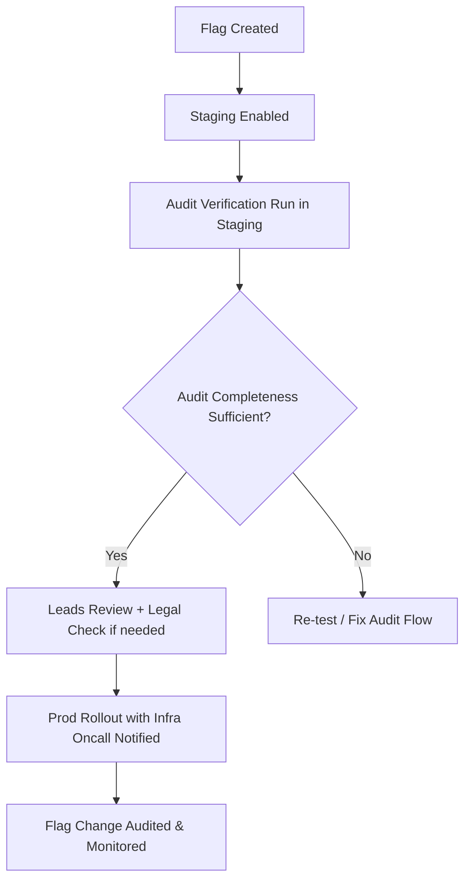

# SafetyToolbox — Admin Tips & Current Practices

*Last updated: 2025-06-12 • Maintainers: SafetyToolbox Leads / Safety Infra Oncall*\
*Last full review: 2025-05-15 → post SAFE-1427 review in progress → SAFE-1444 tracking*\
*This document is a ****living resource****, not a formal playbook. For SEV2+ workflows, use the Incident Playbook → *[*SAFE-1598*](https://jira.rbx.com/browse/SAFE-1598)*.*

---

## ⚠️ If you are reading this because:

✅ You are on Safety Infra Oncall → this is your baseline.\
✅ You are a TS Ops Lead triaging stuck cases → good → cross-check `#safety-infra-oncall`.\
✅ You are Legal reviewing an audit export → see Audit Completeness Matrix.\
✅ You are in SEV2+ → STOP → use Incident Playbook → [SAFE-1598](https://jira.rbx.com/browse/SAFE-1598).\
✅ You are a new Lead → read this full doc prior to first rotation shift.

---

## Meta / TODO

- This is NOT a playbook → **shared internal best-practices + operational tips** → Leads + Infra maintain this.
- Last fully verified: May 2025 → post SAFE-1427 review WIP → SAFE-1444.
- Audit DLQ → batch → stream migration blocked → SAFE-1324.
- StuckCaseDetection tuning → noisy post deploy → SAFE-1879.
- Classifier v5 audit validation → pending post SAFE-1427 → SAFE-1442.
- FeatureFlags audit feed → blocked on FeatureCtl 4.2 → SAFE-1532.
- Infra priority → audit clarity **over system speed**.
- Legal priority → full flag traceability **over UX flow speed**.
- Known gap → AuditFeed export → IRR inconsistencies → SAFE-1221 (legacy).

---

## Admin Principles

✅ **Audit first** → *if it’s not in the audit, it didn’t happen*.\
✅ **Moderator safety second** → preserve clear escalation clarity → avoid clever hacks.\
✅ **System stability third** → don’t destabilize SafetyToolbox → prefer slower correct actions.\
✅ **Cross-team comms** → don’t surprise Legal, Infra, TS Ops.\
✅ **Escalate first → act second** → Infra / Leads aligned on this.

---

## Key Links

- [SafetyToolbox Main](https://tools.simulprod.com/)
- [SafetyToolbox Admin](https://tools.simulprod.com/admin) → NOTE: Admin v2 → migrating to Admin v3 → SAFE-1403.
- [Queue Control](https://tools.simulprod.com/admin/queue_control)
- [Manual Flag Tools](https://tools.simulprod.com/admin/manual_flag_tools) → staging only → prod triggers Infra alert.
- [Audit Trail Viewer](https://tools.simulprod.com/admin/audit_viewer) → DLQ gaps → SAFE-1532.
- [Classifier Info](https://tools.simulprod.com/admin/classifier_info) → caching lag (\~15 min).
- [Staging Env](https://tools.simulprod.com/staging)
- [Staging Hash Search](https://tools.simulprod.com/staging/hash_search)
- [SAFE Project Jira](https://jira.rbx.com/projects/SAFE/summary)
- [SafetyToolbox Service Catalog](https://services.rbx.com/catalog/safetytoolbox)

---

## Post-Flagged Case Escalation Flow

```mermaid
flowchart TD
    A[Case Flagged (P1/P2/P3)] --> B{Escalation Required?}
    B -->|P1 or Legal Trigger| C[Lead Escalation]
    B -->|No| D[Reviewer Process Case]
    C --> E[Lead → Legal Escalation if Required]
    E --> F[Case Review + Audit Trail Complete]
    D --> F
    F --> G[Case Closed → Metrics Exported]
```

---

## Known Gaps / Technical Debt

- Audit DLQ → batch → stream migration blocked → SAFE-1324.
- DLQ Retry Process → occasional artifacts not matching AuditFeed → SAFE-1532.
- Manual Flag Tool → actor.username missing → SAFE-1221 → impacts Legal review.
- Post-Flagged Case Escalation flow → currently partially manual → flagged in SAFE-987.
- Deprecated flags cleanup → not yet auto-enforced → SAFE-1203 → cleanup in progress.

---

## FAQ → Common Questions → Leads / Infra / Legal

**Q:** Do we have to pause queue on SEV2?\
**A:** No → prefer prioritize / clear with Infra → pause only if agreed in SEV flow.

**Q:** Legal expects which audit gaps flagged?\
**A:** DLQ artifacts → flagged → SAFE-1532 → Legal review in SEV postmortem.

**Q:** Can we fast-rollout Classifier v5 in prod?\
**A:** No → pending audit validation → SAFE-1427.

**Q:** Is NextGenUI audited?\
**A:** Yes → InlineAuditEnabled required → verified in SAFE-1150.

**Q:** Infra prefers batch or stream for audit?\
**A:** Stream → blocked on SAFE-1324 → interim batch approved.

---

## Flag Testing Flow



---

## Legal Escalation Trigger Matrix

| Action Type                            | Legal Review Triggered? | Notes                                       |
| -------------------------------------- | ----------------------- | ------------------------------------------- |
| Full User Export → scope >1 month      | Yes                     | Legal pre-review required                   |
| Full Asset Export → flagged CSAM case  | Yes                     | Legal pre-review required                   |
| Manual Flag Tool used on known P1 case | Yes                     | Notify Legal + Leads                        |
| SEV2 Queue Clear >3 partitions         | Yes                     | Post-clear review + postmortem required     |
| Auto-Flag Classifier change → Prod     | Yes                     | Classifier v5 rollout requires Legal review |

---

## Monitoring & Alerts Matrix

| Alert Name                                | PagerDuty Service                | SLA for Oncall Response    |
| ----------------------------------------- | -------------------------------- | -------------------------- |
| SafetyToolboxCaseReviewQueueDepthCritical | PD-SAFETY-TOOLBOX-QDEPTH         | ≤ 15 min                   |
| SafetyToolboxClassifierErrorRateHigh      | PD-SAFETY-TOOLBOX-CLASSIFIER     | ≤ 30 min                   |
| SafetyToolboxAuditIngestFailure           | PD-SAFETY-AUDIT-INGEST           | ≤ 30 min                   |
| SafetyToolboxStuckCaseDetection           | PD-SAFETY-TOOLBOX-STUCKCASE      | ≤ 30 min                   |
| Manual Flag Tool Prod Run Detected        | PD-SAFETY-TOOLBOX-FLAG-TOOL-PROD | Immediate (Infra escalate) |
| DLQ Retry Failure > Threshold             | PD-SAFETY-AUDIT-DLQ-RETRY        | ≤ 1 hour                   |

---

## SAFE Jira Tags Reference Matrix

| Tag Name             | When to Use                               | Required In                 |
| -------------------- | ----------------------------------------- | --------------------------- |
| LEGAL\_PRIORITY      | Any export involving flagged CSAM         | SAFE Jira Issues            |
| AUDIT\_GAP           | When audit event is missing or incomplete | SAFE Jira Issues            |
| SEV2                 | All SEV2 incidents                        | SAFE Jira SEV tracking      |
| SEV3                 | All SEV3 incidents                        | SAFE Jira SEV tracking      |
| FLAG\_ROLLOUT        | All FeatureFlag rollouts impacting Prod   | SAFE FeatureFlag tracking   |
| POSTMORTEM\_REQUIRED | Any SEV requiring full Postmortem         | SAFE Jira Postmortem Issues |

---

## Escalation Slack Channels Matrix

| Purpose                                | Slack Channel Name           | Notes                           |
| -------------------------------------- | ---------------------------- | ------------------------------- |
| SEV2 / SEV3 General Escalation         | `#safety-infra-oncall`       | Primary Infra Oncall channel    |
| Legal Escalation (CSAM / Legal Export) | `#safety-legal-oncall`       | Legal oncall escalation         |
| Leads Escalation                       | `#safety-mod-leads`          | TS Ops Leads + Legal coverage   |
| Classifier Rollout / Issues            | `#safetytoolbox-engineering` | FeatureFlag rollout and issues  |
| AuditFeed Ingest / DLQ Monitoring      | `#safety-infra-oncall`       | Also flagged via PagerDuty      |
| SEV Retrospective Review               | `#safety-sev-retrospective`  | Used for SEV Postmortem reviews |

---

