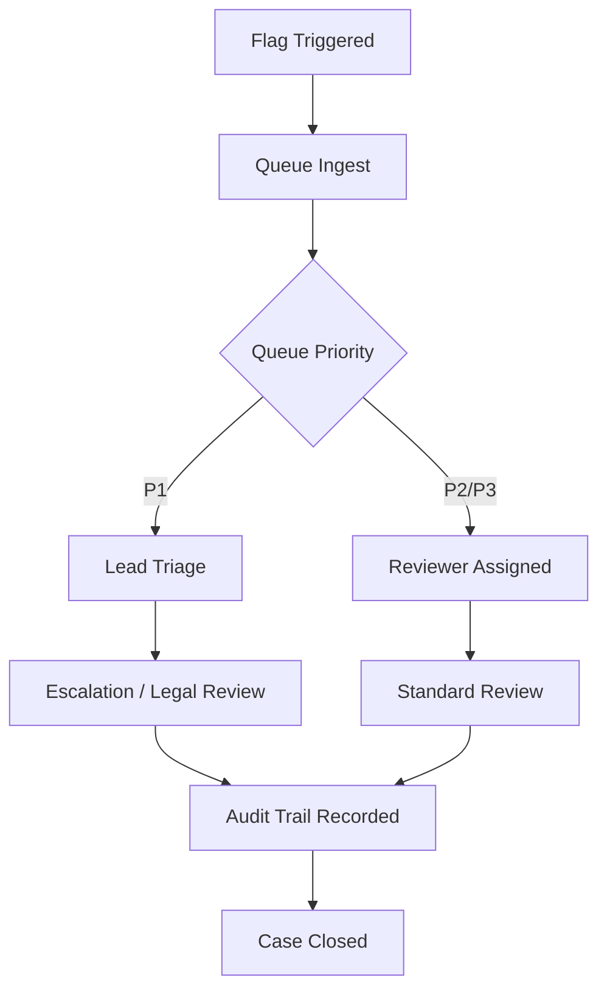
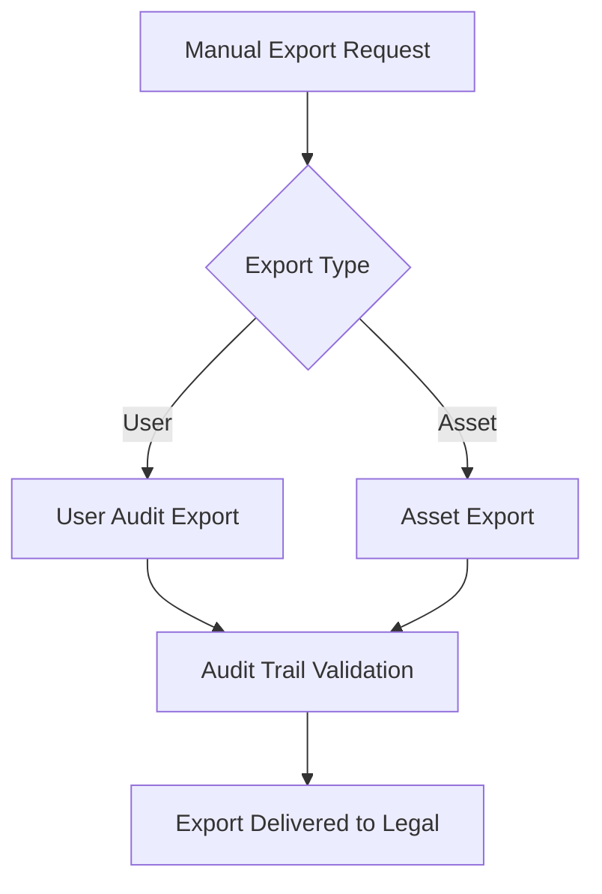
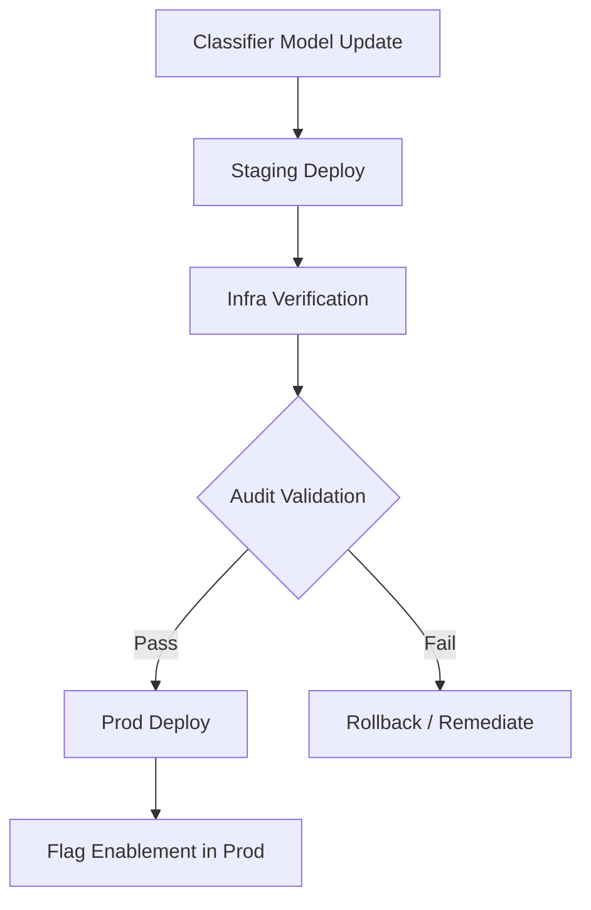

# SafetyToolbox — Admin Tips & Current Practices

*Last updated: 2025-06-12 • Maintainers: SafetyToolbox Leads / Safety Infra Oncall*\
*Last full review: 2025-05-15 → post SAFE-1427 review in progress → SAFE-1444 tracking*\
*This document is a ****living resource****, not a formal playbook. For SEV2+ workflows, use the Incident Playbook → *[*SAFE-1598*](https://jira.rbx.com/browse/SAFE-1598)*.*

---

## ⚠️ If you are reading this because:

✅ You are on Safety Infra Oncall → this is your baseline.\
✅ You are a TS Ops Lead triaging stuck cases → good → cross-check `#safety-infra-oncall`.\
✅ You are Legal reviewing an audit export → see Audit Completeness Matrix.\
✅ You are in SEV2+ → STOP → use Incident Playbook → [SAFE-1598](https://jira.rbx.com/browse/SAFE-1598).\
✅ You are a new Lead → read this full doc prior to first rotation shift.

---

## Meta / TODO

- This is NOT a playbook → **shared internal best-practices + operational tips** → Leads + Infra maintain this.
- Last fully verified: May 2025 → post SAFE-1427 review WIP → SAFE-1444.
- Audit DLQ → batch → stream migration blocked → SAFE-1324.
- StuckCaseDetection tuning → noisy post deploy → SAFE-1879.
- Classifier v5 audit validation → pending post SAFE-1427 → SAFE-1442.
- FeatureFlags audit feed → blocked on FeatureCtl 4.2 → SAFE-1532.
- Infra priority → audit clarity **over system speed**.
- Legal priority → full flag traceability **over UX flow speed**.
- Known gap → AuditFeed export → IRR inconsistencies → SAFE-1221 (legacy).

---

## Admin Principles

✅ **Audit first** → *if it’s not in the audit, it didn’t happen*.\
✅ **Moderator safety second** → preserve clear escalation clarity → avoid clever hacks.\
✅ **System stability third** → don’t destabilize SafetyToolbox → prefer slower correct actions.\
✅ **Cross-team comms** → don’t surprise Legal, Infra, TS Ops.\
✅ **Escalate first → act second** → Infra / Leads aligned on this.

---

## Key Links

- [SafetyToolbox Main](https://tools.simulprod.com/)
- [SafetyToolbox Admin](https://tools.simulprod.com/admin) → NOTE: Admin v2 → migrating to Admin v3 → SAFE-1403.
- [Queue Control](https://tools.simulprod.com/admin/queue_control)
- [Manual Flag Tools](https://tools.simulprod.com/admin/manual_flag_tools) → staging only → prod triggers Infra alert.
- [Audit Trail Viewer](https://tools.simulprod.com/admin/audit_viewer) → DLQ gaps → SAFE-1532.
- [Classifier Info](https://tools.simulprod.com/admin/classifier_info) → caching lag (\~15 min).
- [Staging Env](https://tools.simulprod.com/staging)
- [Staging Hash Search](https://tools.simulprod.com/staging/hash_search)
- [SAFE Project Jira](https://jira.rbx.com/projects/SAFE/summary)
- [SafetyToolbox Service Catalog](https://services.rbx.com/catalog/safetytoolbox)

---

## Known Wonky Behaviors (Leads review weekly → tracked SAFE-1444)

| Behavior                                                 | Status / Comments                                    |
| -------------------------------------------------------- | ---------------------------------------------------- |
| Queue Control "Pause" → UI defer only → ingest continues | Infra known → don’t assume ingest stopped.           |
| Audit Viewer missing `StagingReviewEnabled` in v2 cases  | SAFE-1376 → fixed in Admin v3.                       |
| Classifier Info "last updated" lags \~15 min             | Caching layer → Infra known → expected.              |
| Audit DLQ → occasional double-batch                      | SAFE-1412 → harmless visual dupe → safe.             |
| Manual Flag Tools → missing actor.username edge cases    | SAFE-1221 → legacy bug → blocked FeatureCtl 4.2.     |
| DLQ → IRR flow sometimes out-of-sync                     | SAFE-987 → Infra aware → impacts Legal audit review. |

---

## Moderation Priority Matrix (P1-P3 queues)

| Priority Level | Queue Target SLA | Example Cases                              | Escalation Policy             |
| -------------- | ---------------- | ------------------------------------------ | ----------------------------- |
| P1             | ≤ 15 min         | Confirmed CSAM, Urgent LE request          | Legal + T&S Leads             |
| P2             | ≤ 4 hours        | Harassment w/ UGC, Hate speech, Recidivism | T&S Leads → Legal if required |
| P3             | ≤ 24 hours       | Avatars, Chat logs, Minor UGC violations   | T&S Leads only                |

---

## Feature Flag Rollout Process

1⃣ Always test in staging → verify audit clarity + classifier version.\
2⃣ Post plan in `#safetytoolbox-engineering` → flag rollout → with Jira ref.\
3⃣ Prod rollout → Infra Oncall aware → Leads notified.\
4⃣ Flag change → clear audit reason → not "testing" → Legal expectation.\
5⃣ Confirm FeatureFlagChange audit → if missing → notify `#safetytoolbox-engineering`.\
6⃣ Flag rollback → same process → must be auditable.

---

## Feature Flag Readiness Matrix

| Flag Name              | Status            | Rollout Owner | Verified in Audit Logs | Jira Tracking | Legal Review Required?                       |
| ---------------------- | ----------------- | ------------- | ---------------------- | ------------- | -------------------------------------------- |
| NextGenUI.Enabled      | ENABLED (prod)    | TS Ops        | ✅                      | SAFE-1492     | No                                           |
| ImageClassifierV5      | STAGING ONLY      | Infra         | 🚧                     | SAFE-1427     | Yes (Classifier v5 audit validation pending) |
| InlineAuditEnabled     | ENABLED (prod)    | TS Ops        | ✅                      | SAFE-1150     | No                                           |
| StagingReview\.Enabled | ENABLED (staging) | QA            | ✅                      | SAFE-1355     | No                                           |

---

### Deprecated Flags Matrix

| Deprecated Flag     | Reason                                     | Jira Ticket |
| ------------------- | ------------------------------------------ | ----------- |
| ExperimentalAudioV2 | Deprecated → SAFE-1203 → do not re-enable. | SAFE-1203   |
| LegacyAuditNotes    | Superseded by InlineAuditEnabled.          | SAFE-987    |
| StagingExportFlag   | Removed after SAFE-1121.                   | SAFE-1121   |

---

## Additional Flowcharts

---

## Review History

| Date       | Review Action  | Notes                                 |
| ---------- | -------------- | ------------------------------------- |
| 2025-06-05 | Partial review | SAFE-1427 post-review not completed.  |
| 2025-05-15 | Full review    | NextGenUI rollout verified.           |
| 2025-04-01 | Minor update   | Deprecated Flags Matrix added.        |
| 2025-03-10 | Full review    | InlineAuditEnabled rollout validated. |

---

## Meta

- Maintainers: `@SafetyInfraOncall` rotation + `SafetyToolbox Leads` group.
- Source: `safety-docs` → `/docs/safetytoolbox_admin_tips.md`.
- Last full review: 2025-05-15 → post SAFE-1427 → SAFE-1444 tracking.
- TODOs: DLQ migration → Flag audit feed update → Case matrix update SAFE-1427 → Incident Postmortem Matrix → finalize post SAFE-1444.

---

*Reminder:* **All Admin actions audited** → Legal / Infra / Ops will review.\
**If unsure → escalate first → act second → Infra prefers audit clarity > system speed.**

---

